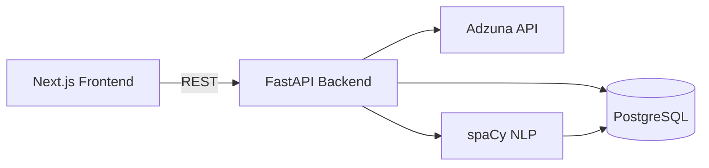

# Jobreel

UK jobs intelligence dashboard — real-time market insights powered by the Adzuna API


[](https://github.com/adewale-codes/jobreel/actions/workflows/ci.yml)

## Overview

Job boards are good at one thing: showing you a list of postings that match a query. What they don't show you is the picture behind that list — which skills are actually in demand across the market right now, how salaries differ by category and region, and which companies are hiring at scale versus posting one role a year. That's the gap Jobreel is built to close.

Jobreel ingests live job postings from the Adzuna API, runs each description through an NLP pipeline to extract a structured set of skills from a curated taxonomy, and stores everything in Postgres for fast aggregation. A FastAPI backend exposes analytics endpoints over that data, and a Next.js dashboard turns it into charts: skill demand rankings, salary bands by category, hiring volume over time, and top companies by posting volume.

The result is a small but complete data pipeline — ingestion, NLP processing, storage, analytics API, and visualization — built around a real, freely available data source rather than synthetic data.

## Architecture



## Tech Stack

| Layer | Technology | Purpose |
|---|---|---|
| Frontend | Next.js 14 + TypeScript + Tailwind CSS | Dashboard UI, charts, job browsing |
| Backend | FastAPI + SQLAlchemy (async) | REST API, ETL pipeline orchestration |
| Database | PostgreSQL + pgvector | Job storage, skill aggregation |
| NLP | spaCy (PhraseMatcher) | Skill extraction from job descriptions |
| Data Source | Adzuna API | Live UK job postings |
| Migrations | Alembic | Database schema versioning |
| CI | GitHub Actions | Automated test runs |
| Infrastructure | Docker Compose | Local dev environment |

## Quick Start

```bash
git clone https://github.com/adewale-codes/jobreel
cd jobreel
cp .env.example .env
# Add ADZUNA_APP_ID and ADZUNA_APP_KEY to .env
make up
make migrate
# Trigger first data ingestion
curl -X POST http://localhost:8000/api/pipeline/trigger
# Open http://localhost:3000
```

## Features

- **Live data ingestion** from the Adzuna API across multiple UK job categories (IT, engineering, science & quality, graduate roles, and more)
- **Automatic skill extraction** from job descriptions using a 200-skill curated taxonomy
- **Analytics dashboard** with total jobs, unique skills tracked, average salary, and pipeline health at a glance
- **Top skills in demand**, ranked and filterable by category
- **Salary band distribution** across the market and per category
- **Jobs-by-category breakdown** with average salary per category
- **Hiring volume over time**, with category filtering
- **Top hiring companies** by posting volume
- **Job search and browsing** with filters for title, category, and location, plus a detail view with extracted skills
- **Pipeline dashboard** to trigger ingestion runs, run skill backfills, and view run history with status and error messages
- **Backfill endpoint** to (re)extract skills for existing jobs without re-fetching from Adzuna

## API Reference

| Method | Endpoint | Description |
|---|---|---|
| GET | `/health` | Service health check |
| POST | `/api/pipeline/trigger` | Run the ingestion pipeline for one or more categories |
| GET | `/api/pipeline/status` | List the most recent pipeline runs |
| GET | `/api/pipeline/runs/{run_id}` | Get details for a single pipeline run |
| POST | `/api/pipeline/backfill` | Re-extract skills for jobs missing them |
| GET | `/api/jobs` | List jobs, with `search`, `category`, `location`, `page`, `limit` filters |
| GET | `/api/jobs/{job_id}` | Get a single job, including its extracted skills |
| GET | `/api/analytics/overview` | Headline stats: total jobs, unique skills, average salary, pipeline status |
| GET | `/api/analytics/top-skills` | Most in-demand skills, optionally filtered by category |
| GET | `/api/analytics/jobs-by-category` | Job counts and average salary per category |
| GET | `/api/analytics/top-companies` | Companies ranked by number of postings |
| GET | `/api/analytics/salary-bands` | Job counts grouped into salary bands |
| GET | `/api/analytics/volume-over-time` | Daily posting volume over a configurable window |

## Architecture Decisions

**Skill extraction**: spaCy PhraseMatcher with a curated 200-skill taxonomy was chosen over LLM-based extraction for two reasons: speed (LLM calls on 500+ job descriptions would cost ~30 seconds and API credits per pipeline run) and consistency (free-form LLM extraction produces inconsistent skill names that are hard to aggregate). The taxonomy approach runs in milliseconds and produces clean, queryable data.

**Sync pipeline**: The pipeline runs synchronously in the HTTP request rather than via a background task queue. For a portfolio project this keeps the architecture simple and makes the trigger-and-wait UX on the pipeline page work naturally. In production with thousands of jobs, this would move to a Celery task with WebSocket progress updates.

## Testing

```bash
make test
```

The backend test suite runs against an in-memory SQLite database and mocks all calls to the Adzuna API, so it requires no external services or credentials.
